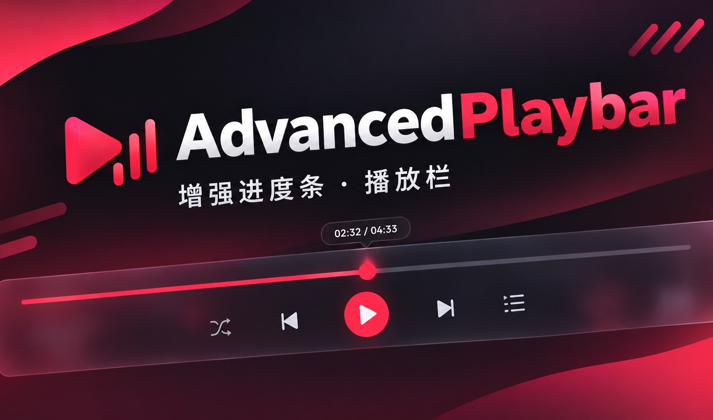

# AdvancedPlayBar

网易云音乐的**播放栏增强**插件，用于 [BetterNCM](https://github.com/std-microblock/BetterNCM)。

## 安装

**方式一（推荐）**：在网易云的 BetterNCM 插件商店里搜索 `AdvancedPlayBar` 安装。

**方式二（手动）**：下载本仓库，把整个目录放进

## 兼容性

- 网易云音乐 **3.1.40**（CEF / Chromium 91）实测通过
- 依赖 BetterNCM `>= 1.3.4`

## 许可

[GPL-3.0](LICENSE)

BetterNCM 本身使用 GPL-v3 协议，本插件与其保持一致。
