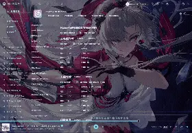

# BGEnhanced-ExtraII
让BGEnhanced插件的背景跟随指针变化，可简单自定义效果  

  
修复当选择跟随移动后使窗口脱焦后无法正确复位图片的bug， 

  
跟随移动功能的两个按钮的合成一个并修改其正确逻辑  

  
更新了（可自行开关）一个计时器用于鼠标停滞在网易云时也可达到不同的亮度设置  
用于在壁纸过亮时在操作（如：搜索、选曲）时不方便使用的问题  
  
同时增添了数个监听器用于监听是否搜索，是否有按键的使用  

  
修改了跟随指针上方的应用和重置按钮修改配置更丝滑。  

  
## 更新：  

  
1、歌单透明  

2、修复了按键触发时没跟随指针  

  
## 注:与来源有一定冲突请不要同时使用  

  
来源[mo-jinran/BGEnhanced-Extra: 让BGEnhanced插件的背景跟随鼠标缩放偏移](https://github.com/mo-jinran/BGEnhanced-Extra)  

  
## 效果图  

  
  
  
  ## 配置图

