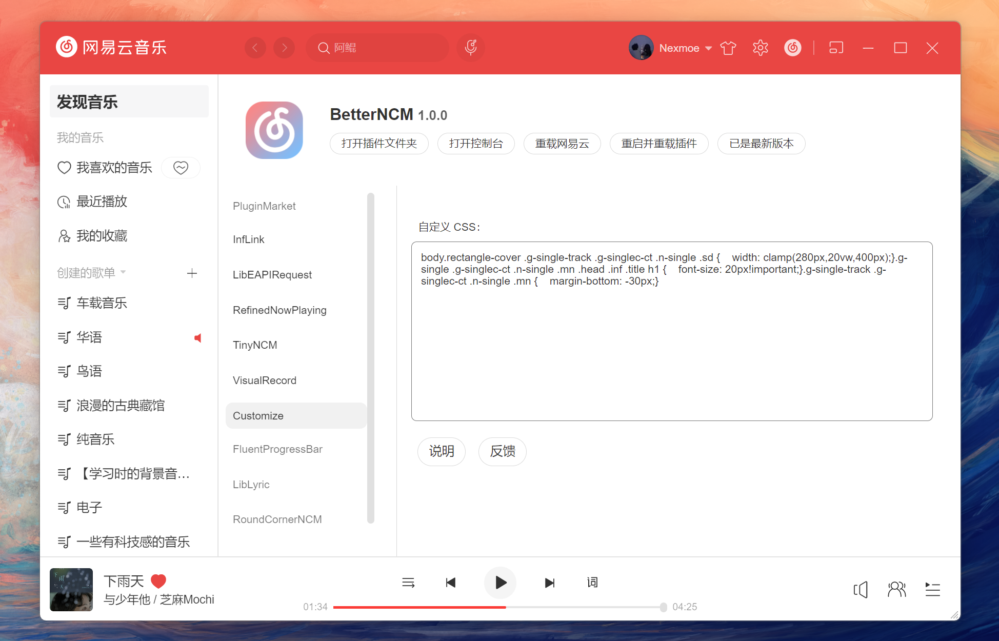
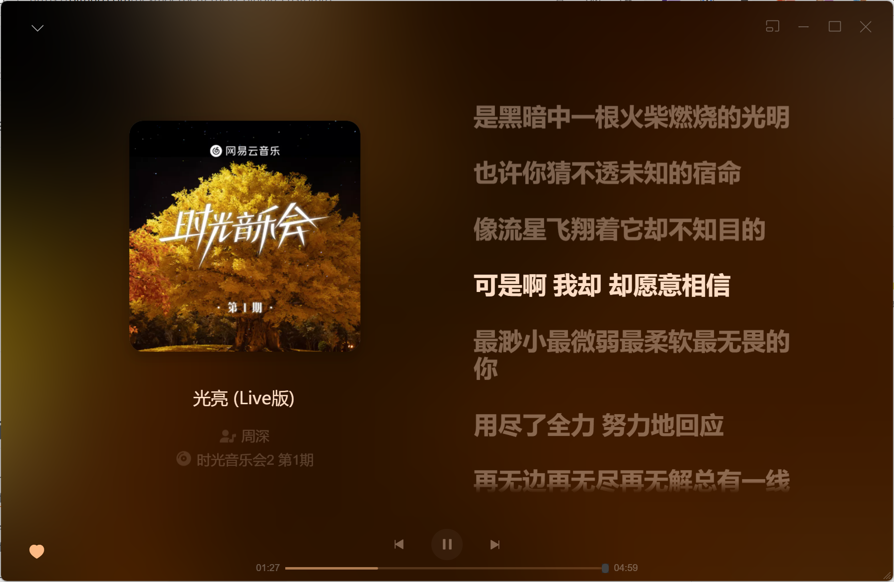

<div align="center"><image width="140em" src="https://user-images.githubusercontent.com/66859419/183120498-1dede5b4-0666-4891-b95f-c3a812b3f12f.png" /></div>
<h1 align="center">BetterNCM Plugin Customize</h1>
<p align="center">注入你的 CSS，让网易云变成你的形状</p>



## Example

### CSS

以下 CSS 代码魔改了 RedefineNowPlaying

```css
body.rectangle-cover .g-single-track .g-singlec-ct .n-single .sd {
	width: clamp(280px, 20vw, 400px);
}
.g-single .g-singlec-ct .n-single .mn .head .inf .title h1 {
	font-size: 20px !important;
}
.g-single-track .g-singlec-ct .n-single .mn {
	margin-bottom: -32px;
}
.rnp-lyrics {
	font-weight: bold;
}
.m-nav li a,
.m-nav li .edt {
	border-radius: 6px !important;
}
.m-nav li.z-sel a {
	background: rgba(31, 33, 51, 0.07);
}
```



### JavaScript

延迟 1 秒后自动打开我喜欢的音乐

```js
console.log("首次启动时执行");
window.onload = function () {
	setTimeout(function () {
		document.querySelector("#my-music-list > li.lke.j-flxg a").click();
	}, 1000);
};
```


## 教程

- [CSS 基础](https://developer.mozilla.org/zh-CN/docs/Learn/Getting_started_with_the_web/CSS_basics)
- [JavaScript 基础](https://developer.mozilla.org/zh-CN/docs/Learn/Getting_started_with_the_web/JavaScript_basics)

## 分享你的代码片段

<https://github.com/nexmoe/betterncm-plugin-customize/discussions/new?category=show-and-tell>
